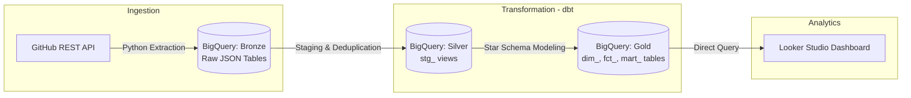

```markdown
# GitHub Analytics ELT Pipeline (BigQuery & dbt)

An end-to-end ELT data pipeline that extracts developer productivity and repository metrics from the GitHub REST API, loads semi-structured data into Google Cloud BigQuery, models the data using dbt Core under the Medallion Architecture (Star Schema), and serves analytical data marts for visualization in Looker Studio.

---
```
## Architecture Overview



---

## Tech Stack

* **Extraction & Ingestion:** Python 3.12, GitHub REST API, `google-cloud-bigquery` client library
* **Data Warehouse:** Google Cloud BigQuery
* **Data Transformation & Modeling:** dbt Core (v1.12), SQL (CTEs, window functions, JSON parsing)
* **Data Quality & Testing:** dbt Test suite (schema constraints, referential integrity)
* **BI / Data Visualization:** Google Looker Studio
* **Version Control:** Git, GitHub

---

## Data Architecture (Medallion Pattern)

### 1. Bronze Layer (`data_bronze`)

* Ingests raw JSON payloads directly from GitHub API endpoints (`/repos`, `/commits`, `/pulls`).
* Stores raw metadata along with ingestion timestamps (`ingested_at`) for auditability and replayability.

### 2. Silver Layer (`data_silver` / Staging)

* **`stg_repositories`**: Parses repository metadata (stars, forks, open issues, language).
* **`stg_commits`**: Flattens commit logs, parses author identities, and standardizes UTC timestamps.
* **`stg_pull_requests`**: Extracts PR lifecycle events and states (`open`, `closed`, `is_merged`).
* **Deduplication:** Implements `ROW_NUMBER() OVER (PARTITION BY id ORDER BY ingested_at DESC)` to handle duplicate API loads.

### 3. Gold Layer (`data_silver` / Marts)

* **`dim_repositories`**: Master repository dimension.
* **`dim_authors`**: Unified contributor dimension combining commit authors and PR authors using MD5 deterministic surrogate keys (`author_id`).
* **`fct_commits`**: Fact table tracking developer commit behaviors (day of week, commit hour, message length).
* **`fct_pull_requests`**: Fact table calculating engineering metrics (pull request resolution/lead time in hours).
* **`mart_repository_overview`**: Pre-aggregated metrics table optimized for BI dashboard queries.

---

## Data Quality & Testing

Data integrity is enforced using automated dbt test assertions:

* **Primary Key Integrity:** `unique` and `not_null` constraints on `repo_id`, `commit_sha`, `pr_id`, and `author_id`.
* **Referential Integrity:** `relationships` foreign key tests linking `fct_commits` and `fct_pull_requests` back to `dim_repositories`.
* **Value Constraints:** `accepted_values` validation on PR states (`['open', 'closed']`).

Test validation output:

```text
PASS=8 WARN=0 ERROR=0 TOTAL=8

```

---

## Repository Structure

```text
.
├── dbt_github/
│   ├── dbt_project.yml              # dbt configuration
│   ├── packages.yml                 # dbt package dependencies
│   ├── models/
│   │   ├── staging/
│   │   │   ├── sources.yml          # Bronze source declarations
│   │   │   ├── schema.yml           # Staging tests and documentation
│   │   │   ├── stg_repositories.sql # Repositories staging model
│   │   │   ├── stg_commits.sql      # Commits staging model
│   │   │   └── stg_pull_requests.sql# Pull requests staging model
│   │   └── marts/
│   │       ├── schema.yml           # Marts data integrity tests
│   │       ├── dim_repositories.sql # Repository dimension
│   │       ├── dim_authors.sql      # Author dimension
│   │       ├── fct_commits.sql      # Commits fact table
│   │       ├── fct_pull_requests.sql# Pull requests fact table
│   │       └── mart_repository_overview.sql # Analytical summary mart
├── scripts/
│   ├── ingest_github.py             # Python ingestion script (API to BigQuery)
│   ├── check_silver.py              # Staging data audit script
│   └── audit_gold.py                # Gold layer validation script
├── assets/
│   ├── dbt_dag_lineage.png          # dbt lineage DAG diagram
│   └── dashboard_preview.png        # Looker Studio dashboard preview
├── .gitignore                       # Ignored files (GCP credentials, venv)
├── requirements.txt                 # Python dependencies
└── README.md                        # Documentation

```

---

## Reproduction Guide

### 1. Prerequisites

* Python 3.10+
* Google Cloud Platform account with BigQuery enabled
* Service Account key with `BigQuery Admin` or `BigQuery Data Editor` roles

### 2. Environment Setup

```bash
git clone [https://github.com/ChenStormtout/github-elt-pipeline-dbt-bigquery.git](https://github.com/ChenStormtout/github-elt-pipeline-dbt-bigquery.git)
cd github-elt-pipeline-dbt-bigquery

python -m venv .venv
# Windows:
.venv\Scripts\activate
# Linux/macOS:
source .venv/bin/activate

pip install -r requirements.txt

```

### 3. Authentication

Place your GCP Service Account JSON key in the root directory.

### 4. Execute Ingestion (Bronze Layer)

```bash
python scripts/ingest_github.py

```

### 5. Execute dbt Transformations & Tests (Silver & Gold Layers)

```bash
cd dbt_github
dbt deps
dbt run
dbt test

```

### 6. Verify Gold Layer Data

```bash
python ../scripts/audit_gold.py

```

---

## Dashboard

The data mart feeds a Looker Studio dashboard displaying:

* Repository comparison by Stars and Forks
* PR resolution lead time across frameworks
* Contributor activity and commit distribution patterns

```

```
